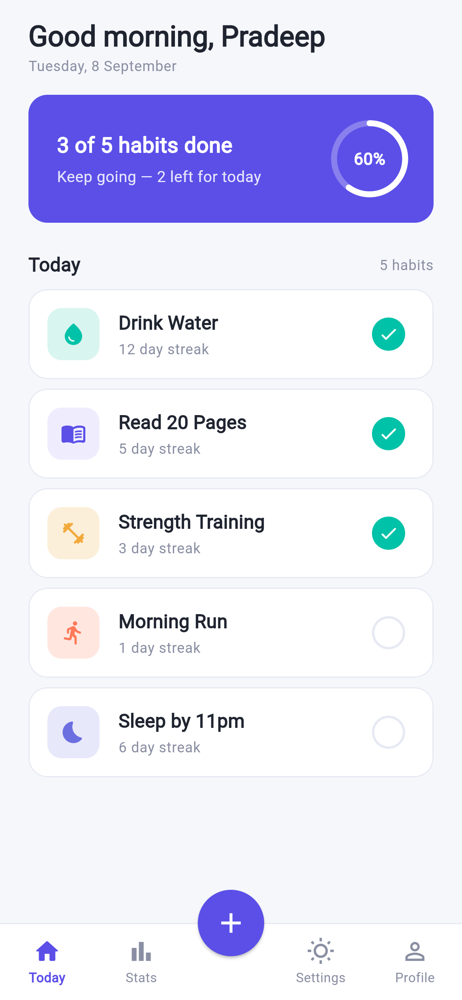
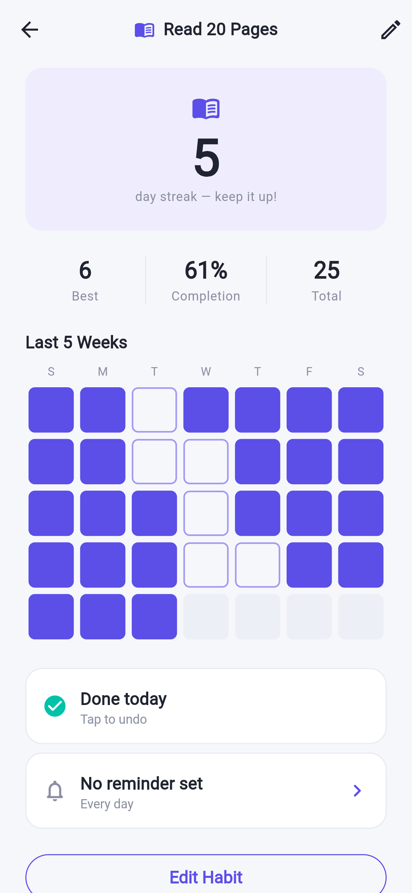
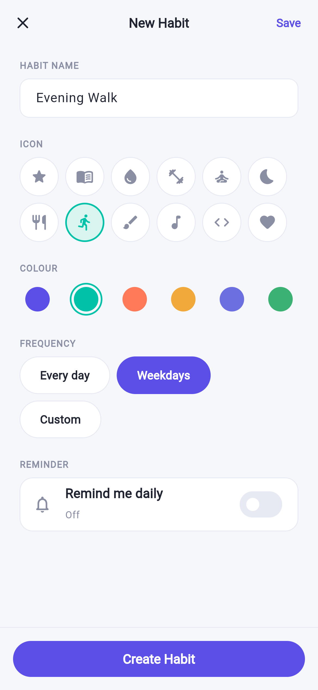
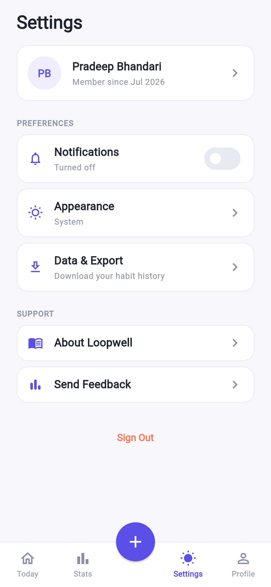

# Loopwell — *Small steps, every day.*

A daily habit tracker built with Flutter for **ICT725 User Experience and Mobile
Application Development, Assessment 3**. It is the working front end of the
Figma prototype produced for Assessment 2.

Loopwell logs a habit in one tap, keeps an honest streak that a single missed
day does not reset, and stores everything on the device — no account, no
backend, nothing uploaded.



## Screens

| Home | Habit Detail | Add Habit | Settings |
|---|---|---|---|
|  |  |  |  |

Full set, including onboarding and dark mode, in [`screenshots/`](screenshots/).

## Running it

```bash
git clone https://github.com/Sapun2/loopwell.git
cd loopwell
./run.sh          # Windows: run.bat
```

That installs dependencies, finds a device, and launches — an emulator if one
is running, otherwise Chrome. The only prerequisite is
[Flutter](https://docs.flutter.dev/get-started/install).

```bash
./run.sh android    # force an Android emulator (starts it for you)
./run.sh chrome     # force the browser
```

See [`RUN_GUIDE.md`](RUN_GUIDE.md) for the 5-step Android emulator setup,
[`HANDOVER.md`](HANDOVER.md) for setting the project up on another Mac over
AnyDesk, and [`DEMO_SCRIPT.md`](DEMO_SCRIPT.md) for the presentation
walkthrough.

On a Mac with nothing installed, `./setup_mac.sh` installs Flutter, the Android
SDK and an emulator in one step.

Built and verified against **Flutter 3.47.2 / Dart 3.13.2** (stable). The
project has platform folders for Android, iOS, web, macOS, Linux and Windows.
There is no backend and no configuration — it runs offline out of the box, and
seeds five sample habits with history on first launch so every screen has
something to show.

```bash
flutter analyze   # clean, no issues
flutter test      # 15 unit tests over the streak / completion-rate logic
```

## Feature scope

Every functional requirement from the Assessment 2 report is implemented except
one, deliberately:

| ID | Requirement | Status |
|---|---|---|
| FR1 | Onboarding carousel | Implemented |
| FR2 | Daily dashboard with summary | Implemented |
| FR3 | Create habit (name, icon, colour, frequency) | Implemented |
| FR4 | Reminders | **Partly** — see below |
| FR5 | Mark complete / undo | Implemented |
| FR6 | Habit detail: streak, rate, heat map | Implemented |
| FR7 | Edit / delete a habit | Implemented |
| FR8 | Settings: notifications, appearance, export, profile | Implemented |

**FR4.** A per-habit reminder can be switched on, given a time, and is stored
and displayed on the habit — the front-end UI is complete. Actually firing an
OS-level notification at that time needs platform notification permissions and
native scheduling (`flutter_local_notifications` plus Android/iOS manifest
changes), which sits outside plain front-end UI work and cannot be tested
honestly without a physical device. It is left as a clearly scoped next step
rather than bolted on untested.

Beyond the original scope, the app also adds a **Stats** overview, an on-device
**Profile**, and a full **dark theme** behind Settings → Appearance.

## Project layout

```
Loopwell_Flutter_App/
├── README.md               this file
├── run.sh / run.bat        one-command launcher
├── setup_mac.sh            one-time setup for a fresh Mac
├── RUN_GUIDE.md            how to run it on any device
├── HANDOVER.md             setting up on another Mac over AnyDesk
├── DEMO_SCRIPT.md          presentation walkthrough (weeks 11-12)
├── REPORT.md               the Assessment 3 report
├── docs/                   the report as .docx and .pdf for submission
├── flutter_app/            the Flutter project
│   ├── lib/
│   │   ├── main.dart               root gate: onboarding vs. app shell
│   │   ├── theme/app_theme.dart    every colour, radius and type style
│   │   ├── models/                 Habit + derived streak/rate logic, icon map
│   │   ├── services/               HabitStore (ChangeNotifier + SharedPreferences)
│   │   ├── screens/                onboarding, home, add/edit, detail, settings, stats, profile
│   │   └── widgets/                app shell, habit card, heat map, progress ring
│   └── test/habit_test.dart        unit tests for the derived statistics
├── design/
│   ├── design_tokens.md    colours, type scale, spacing — the source of truth
│   ├── figma_link.txt      the live Figma prototype
│   └── screenshots/        frames exported from the Figma file
├── spec/PRD.md             requirements, data model, navigation map
└── screenshots/            screenshots of the running Flutter app
```

## Assessment 3 links

- **Report:** [`REPORT.md`](REPORT.md) — also in [`docs/`](docs/) as `.docx` and `.pdf`
- **Figma high-fidelity prototype:** <https://www.figma.com/design/yZf92ARQOn7lqavVbicKaS/Loopwell---UX-Prototype--ICT725-?node-id=14-3>
- **GitHub repository:** <https://github.com/Sapun2/loopwell>

## Architecture notes

- **State**: a single `HabitStore` (`ChangeNotifier` + `provider`). The data set
  is small and there is no server state to reconcile, so a heavier state
  management package would add complexity without benefit.
- **Persistence**: `shared_preferences`, habits JSON-encoded under one key.
- **Derived, never stored**: `currentStreak`, `bestStreak` and completion rates
  are computed from the completions list on read — persisting them would let
  them go stale the moment a day is un-ticked.
- **Design system**: `app_theme.dart` is the only place colours, radii and type
  are defined; it is generated from `design/design_tokens.md`.
- **Accessibility**: every tappable control clears a 44x44pt hit area even where
  the painted control is smaller, and the completion tick publishes its own
  semantics node so it is not merged into the card's.

## AI use disclosure

This app was built with substantial AI assistance (Claude), consistent with the
disclosure made for Assessment 2 and KOI's academic integrity declaration.
