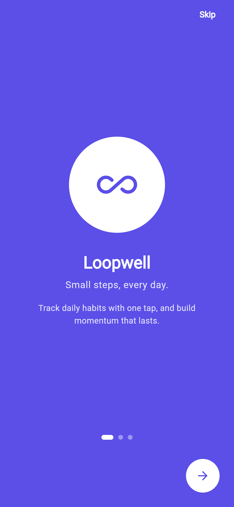

# Loopwell — A Daily Habit Tracker

**ICT725 User Experience and Mobile Application Development — Assessment 3**\
**Student:** Pradeep Bhandari\
**Trimester:** T2 2026\
**Platform:** Flutter (cross-platform: Android, iOS, web, desktop)

---

## 1. Introduction

Loopwell is a cross-platform mobile application that helps a person build and
keep daily habits. Its promise is deliberately narrow — *small steps, every
day* — and the whole interface is arranged around a single question the user
asks each morning: *what do I still need to do today?*

Most habit trackers fail their users in one of two ways. They either demand so
much setup and configuration that logging a habit becomes another chore, or
they punish inconsistency by resetting a streak to zero the moment a day is
missed, which is precisely the point at which a discouraged user abandons the
app. Loopwell was designed against both failure modes.

The usability of the application rests on four decisions. First, **logging is a
single tap**: the completion circle sits on the right-hand edge of every habit
card on the Home screen, so marking a habit done requires no navigation, no
confirmation dialog, and no gesture the user has to be taught. Second, **the
summary is honest**: the progress card counts only habits actually scheduled
for today, so a weekday-only habit does not read as "missed" on a Sunday.
Third, **the form has sensible defaults** — a new habit arrives with an icon,
a colour, "every day", and no reminder already selected, so a user in a hurry
can type a name and save. Fourth, **nothing is a dead end**: every screen has a
clear way back, and destructive actions are confirmed.

The application requires no account and no internet connection. All data is
stored on the device, which removes the sign-up friction that typically sits
between a user and their first logged habit, and means the application works
offline from the moment it is installed.

---

## 2. Functional and Non-Functional Requirements

These requirements are carried forward from the Assessment 2 report and were
used directly as the build specification.

### 2.1 Functional requirements

| ID | Requirement | Status in Assessment 3 |
|----|-------------|------------------------|
| FR1 | **Onboarding** — introduce the value proposition and route into the app | Fully implemented |
| FR2 | **Daily dashboard** — every habit with status, one-tap completion, and a summary | Fully implemented |
| FR3 | **Create habit** — name, icon, colour, and frequency | Fully implemented |
| FR4 | **Reminders** — a per-habit reminder with a set time | Partly implemented (see Section 5) |
| FR5 | **Mark complete or undo** — toggle completion for the day | Fully implemented |
| FR6 | **Habit detail** — streak, completion rate, and heat map | Fully implemented |
| FR7 | **Edit or delete** an existing habit | Fully implemented |
| FR8 | **Settings** — notifications, appearance, data export, profile | Fully implemented |

Seven of the eight functional requirements are fully working end to end, well
beyond the assessment's requirement of a minimum of two major features.

### 2.2 Non-functional requirements

| Requirement | How the implementation satisfies it |
|---|---|
| **Usability** — completion usable without instruction | One tap on the status circle on the Home card; no confirmation, no gesture to learn |
| **Performance** — transitions resolve quickly | Standard `MaterialPageRoute` transitions; the UI updates optimistically and the disk write is awaited afterwards, so the interface never blocks on storage |
| **Accessibility** — WCAG 2.1 AA contrast, 44pt touch targets | Every tappable control clears a 44×44pt hit area even where the painted control is smaller; the completion tick publishes its own accessibility node so a screen reader does not announce the whole card as one control |
| **Consistency** — one shared design system | `lib/theme/app_theme.dart` is the single place colours, radii, and type are defined; it is generated from the design token table used for the Figma prototype |
| **Responsiveness** — usable across device sizes | Flexible layouts with no hardcoded pixel widths; verified on compact (320×568), standard (390×844) and large (430×932) viewports with no overflow |
| **Privacy** — no account, data on device | No backend and no authentication; habits are JSON-encoded into `shared_preferences` on the device |

---

## 3. Figma High-Fidelity Prototype

The interactive high-fidelity prototype produced for Assessment 2, with all
frames wired together:

**https://www.figma.com/design/yZf92ARQOn7lqavVbicKaS/Loopwell---UX-Prototype--ICT725-?node-id=14-3**

The file contains three pages: a Cover, a Wireframes page with five linked
low-fidelity screens, and a Hi-Fi Prototype page with seven high-fidelity
frames (three onboarding slides, Home, Add/Edit Habit, Habit Detail & Stats,
and Settings), all linked with click-through interactions.

---

## 4. Implemented Front-End Functionality

The application was built in Flutter 3.47.2 / Dart 3.13.2 using `provider` for
state management and `shared_preferences` for local persistence. `flutter
analyze` reports no issues, and 15 unit tests cover the streak and
completion-rate logic.

### 4.1 Onboarding (FR1)

{ width=2.0in }

A three-slide carousel on the brand indigo background introduces the value
proposition. Slides one and two offer *Skip*; the third commits with *Get
Started*. Completion is persisted, so the carousel is shown only on first
launch and the app opens directly on Home thereafter.

### 4.2 Daily dashboard and one-tap completion (FR2, FR5)

{ width=2.0in }

Home is the hub of the application. A time-aware greeting and today's date sit
above a filled progress card that states how many of today's scheduled habits
are done, with a matching progress ring. Below it, each habit is a card showing
its icon in a tinted tile, its name, and its current streak.

The circle on the trailing edge of each card is the one-tap completion control
(FR5). Tapping it toggles today's completion in place: the circle fills, the
streak recalculates, the summary card and progress ring update, and the change
is written to disk — all without leaving the screen. Tapping the body of the
card instead opens that habit's detail screen. A docked "+" button opens the
create-habit form, and a bottom navigation bar provides the four top-level
destinations.

### 4.3 Create and edit a habit (FR3, FR7)

{ width=2.0in }

The form collects a name, an icon from a twelve-icon grid, one of six brand
colours, a frequency, and an optional reminder. Frequency is expressed as three
presets — *Every day*, *Weekdays*, and *Custom* — where Custom reveals a
Monday-to-Sunday picker. This keeps the common case to a single tap while still
supporting arbitrary schedules.

Every field is pre-filled with a sensible default, so a habit can be created by
typing a name and pressing *Create Habit*. Saving with an empty name is blocked
with an inline validation message. The same screen serves editing (FR7),
pre-filled from the existing habit, with a delete action behind a confirmation
dialog that names the habit and warns that its history will be lost.

### 4.4 Habit detail and statistics (FR6)

{ width=2.0in }

The detail screen opens on a tinted hero card carrying the current streak as a
large numeral. Beneath it sit three statistics — best streak ever, lifetime
completion percentage, and total completions — followed by a five-week heat
map. Each cell is one day: filled in the habit's colour when completed,
outlined when the habit was scheduled and missed, and faint when it was not
scheduled or predates the habit. This turns an abstract percentage into a
pattern the user can read at a glance.

Importantly, none of these figures are stored. Streaks and rates are computed
from the completion history every time they are read, so they can never
disagree with the underlying data after a day is un-ticked.

### 4.5 Settings (FR8)

{ width=2.0in }

Settings opens on a profile card, then groups preferences and support options
as individually carded rows. *Appearance* switches between Light, Dark, and
System and applies immediately across the app. *Data & Export* opens the user's
complete habit history as formatted JSON with a copy-to-clipboard action, which
supports the privacy commitment by making the stored data fully visible and
portable. *Sign Out* is presented honestly: a dialog explains that Loopwell has
no account system, that this returns the user to the welcome screens, and that
their habits remain saved on the device.

### 4.6 Additional functionality beyond the prototype

Three additions were made during implementation: a **Stats** screen giving a
weekly completion rate across all habits and a per-habit ranking; a **Profile**
screen with an editable display name and lifetime totals; and a complete **dark
theme**, which the Figma prototype did not cover.

---

## 5. Remaining Front-End Functionality Not Implemented

One requirement is deliberately incomplete.

**FR4 — Reminders (partly implemented).** The front-end work for this
requirement is finished: a reminder can be switched on, given a time through
the platform time picker, and is stored, persisted, and displayed on both the
habit card and the detail screen. What is not implemented is the delivery of an
actual operating-system notification at that time.

This was a considered decision rather than an oversight. Firing a real
notification requires the `flutter_local_notifications` package, runtime
notification permissions, Android manifest changes with an exact-alarm
permission, an iOS notification capability, and timezone-aware scheduling. That
work sits outside front-end UI development, and — more importantly — it cannot
be verified honestly without a physical device to confirm that a notification
actually arrives at the scheduled time on a locked phone. Shipping scheduling
code that has never been observed working would be worse than scoping it out
clearly. It is therefore documented as the next increment of work, with the UI
that will drive it already complete and tested.

No other functional requirement is outstanding.

---

## 6. GitHub Repository

The complete source code, including all platform folders, the design tokens,
the Figma reference frames, and the application screenshots:

**https://github.com/Sapun2/loopwell**

The repository is public. It builds from a clean clone with `flutter pub get`
followed by `flutter run`, requires no configuration or API keys, and seeds
sample habits with history on first launch so every screen has content to show.
A step-by-step guide for running it on Android, iOS, web, or desktop is
included in `RUN_GUIDE.md`.

---

## 7. Conclusion

Loopwell delivers seven of its eight functional requirements as working
cross-platform software, with the eighth scoped and documented rather than left
implied. The implementation follows the Assessment 2 high-fidelity prototype
closely, drawing its colours, spacing, and corner radii from the same design
token table so that the built application and the Figma file remain visibly the
same product.

The exercise reinforced how much of usability is decided before any code is
written. The choices that make Loopwell pleasant to use — one-tap logging, an
honest denominator on the summary card, defaults that make the create form
optional — were all made at the prototype stage, and implementing them was
largely a matter of not compromising them under pressure. Equally, the parts
that required the most care during the build were the invisible ones: keeping
derived statistics derived rather than stored, ensuring the accessibility tree
reflected what the interface actually offered, and confirming the layout held
together on a small phone as well as a large one.

The clearest next step is completing FR4 with real notification scheduling on a
physical device, followed by an optional encrypted backup so a user's history
survives changing phones — the one genuine cost of the local-only privacy model
this application deliberately chose.

---

### AI use disclosure

This application and report were produced with substantial AI assistance
(Claude), consistent with the disclosure made for Assessment 2 and KOI's
academic integrity requirements.
